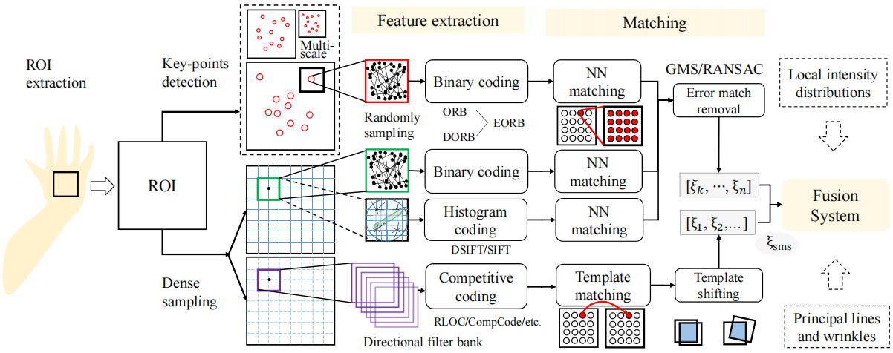
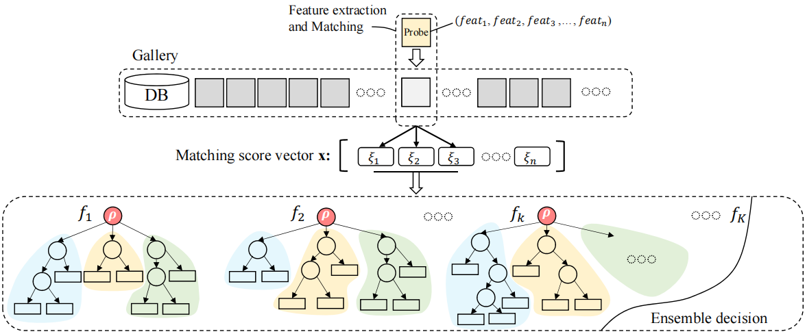

# [Preparing ...]

# same

SaME: Sharpness-aware Matching Ensemble for Robust Palmprint Recognition 

[ [arxiv]() | [supp]()]

Contributions:

- Sharpness analysis: GSS, SQI, and SMS:eagle:
- Multi-feature extraction and matching framework:  :elephant:
- Sharpness-aware matching ensemble model: ME:meat_on_bone:, SaME:cactus:

---

SaME = SMS + RLOC + SIFT + ORB + ME

---

## 1. Pipeline

### 1.1 Multifeature Extraction and Matching

Fig. 1 Multi-feature Extraction Method.

### 1.2 Matching Ensemble

Fig. 2 The framework of SaME

# ...

